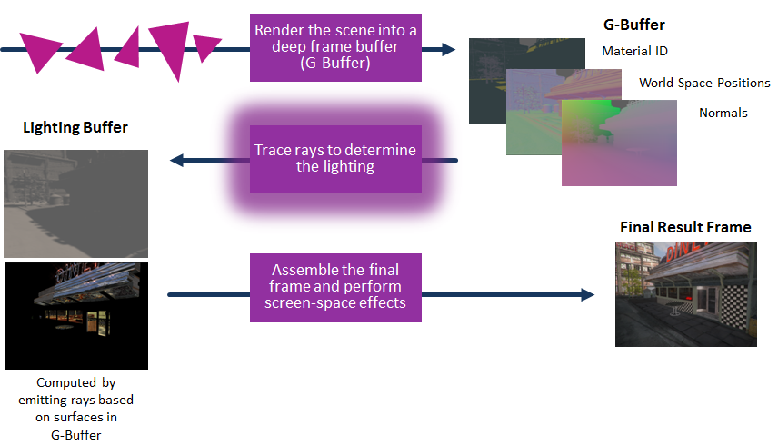

# University of Pennsylvania, CIS 565: GPU Programming and Architecture.
Final Project: Hybrid Ray-Raster Renderer in Vulkan
===============

## Team members
- **Names:** Trung Le and David Grosman.
- **Tested on:** 
 * Microsoft Windows 10 Home, i7-4790 CPU @ 3.60GHz 12GB, GTX 980 Ti (Person desktop).
 * Microsoft Windows  7 Professional, i7-5600U @ 2.6GHz, 256GB, GeForce 840M (Personal laptop).

 ## Overview
 We want to implement a hybrid raytracer-rasterizer[1] program in Vulkan[2] to accommodate rendering transparent objects for games. The basic concept is to use rasterization as deferred rendering for opaque objects in the scene and then apply a ray tracing pass on top of the G-buffer to render transparency and correct shadows. A ray-raster hybrid can also offer better anti-aliasing than the traditional shadow mapping of a pure rasterizer.

The ray tracing component relies heavily on the compute power of the GPU, so we decided to use the Vulkan API since it supports access to both the graphics queue and the compute queue. In comparison to OpenGL, Vulkan doesn’t offer a drastic improvement in performance if the pipeline follows the rasterize-then-raytrace pattern. However, rasterization and ray tracing can be done asynchronously because Vulkan (and DirectX12) supports async compute[3]. This is a new feature that explicit graphics API offer over the traditional OpenGL style API that puts modern game engines in the more effective multithreading pattern. Games such as DOOM[4] and Rise of the Tomb Raider[5] take advantage of this async compute power to optimize for performance on threads that are idle and ready to submit compute command buffers .

To summarize, our final project is two-fold: 
 1. Realistic rendering of transparent objects and shadows via ray tracing.
 2. Taking advantage of the Vulkan’s async compute to optimize for performance.

As the end result, we would like to demonstrate both of the above bullet points to be feasible and analyze the performance with async compute on versus off to validate our hypothesis of its advantage.

Part of the goal for this project is also to learn about explicit graphics API for rendering.

 
 
 
 ## Plan
 1. A basic Vulkan deferred renderer with glTF mesh support.
 2. Ray tracing for transparent objects using compute shaders.
 3. Physically accurate shadows via ray tracing.
 4. An acceleration data structure, BVH or kd-tree, for ray tracing. (Async Compute)
 5. Async compute for multithreading.
 
 ## Credits
* [Practical techniques for ray-tracing in games](http://www.gamasutra.com/blogs/AlexandruVoica/20140318/213148/Practical_techniques_for_ray_tracing_in_games.php)
* [GDCVault14: Practical techniques for ray-tracing in games] (http://www.gdcvault.com/play/1020688/Practical-Techniques-for-Ray-Tracing)
* [Vulkan, Industry Forged](https://www.khronos.org/vulkan/)
* [Asynchronous Compute in DX12 & Vulkan: Dispelling Myths & Misconceptions Concurrently](https://youtu.be/XOGIDMJThto)
* [Doom benchmarks return: Vulkan vs. OpenGL](http://www.pcgamer.com/doom-benchmarks-return-vulkan-vs-opengl/2/)
* [Rise of the Tomb Raider async compute update boosts performance on AMD hardware](https://www.extremetech.com/gaming/231481-rise-of-the-tomb-raider-async-compute-update-improves-performance-on-amd-hardware-flat-on-maxwell)
* [Imagination PowerVR 6XT GR6500 mobile GPU - Ray Tracing demos vs Nvidia Geforce GTX 980 Ti](https://youtu.be/ND96G9UZxxA)

 
